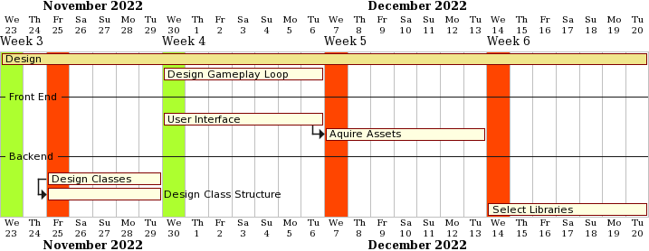
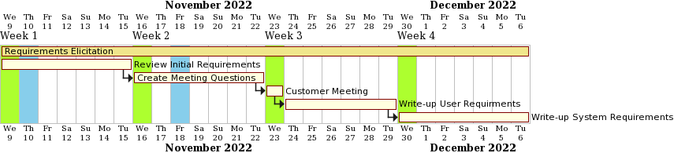
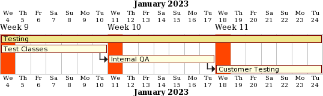
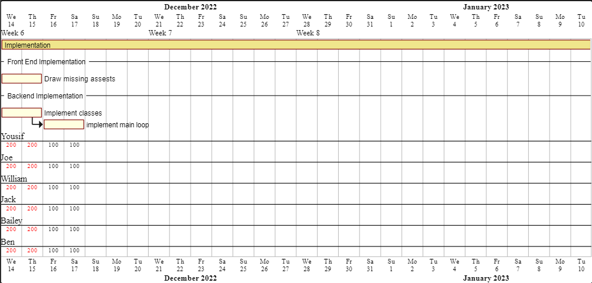
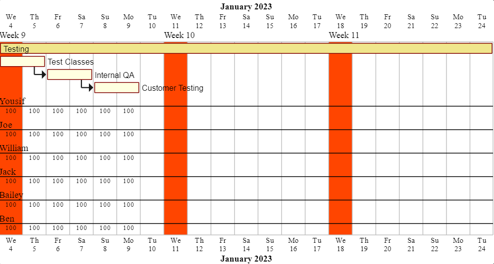

# Planning

Lorem ipsum dolor sit amet, consectetur adipiscing elit. Nulla tristique dolor non justo venenatis, vitae fringilla orci tristique. Morbi vitae hendrerit erat. In hac habitasse platea dictumst. Aliquam ultrices lectus eu lobortis malesuada. Sed eu sapien erat. Etiam lacinia mauris quis libero egestas finibus. Duis nisi elit, ultrices id imperdiet id, consectetur in justo. Aenean sed varius odio, ac laoreet nulla. Curabitur bibendum quis velit vitae placerat. Duis nisl dolor, posuere sed luctus in, porta quis erat. Nunc lorem risus, maximus sed condimentum sit amet, congue eget magna. Nunc pharetra accumsan elit. Vestibulum sit amet dapibus ex. Ut mattis ultrices magna ac tempor. 

## Weekly plan

### **21/11/2022**

Our initial Gantt charts. Work is not yet assigned to members of the team

---

---

---

---

### **28/11/2022**

---

---

---

---

## Plan1.pdf

<object data="../pdf/Plan1.pdf" type="application/pdf" width="100%" height="500">
</object>