---
hide:
  - navigation
  - footer
---

# Planning

## Weekly plan

Each week contains Gannt charts and a workbreakdown

### **Version 1**

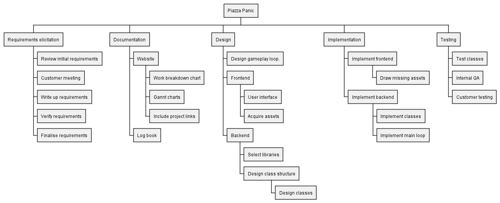

Our initial Gantt charts. Work is not yet assigned to members of the team

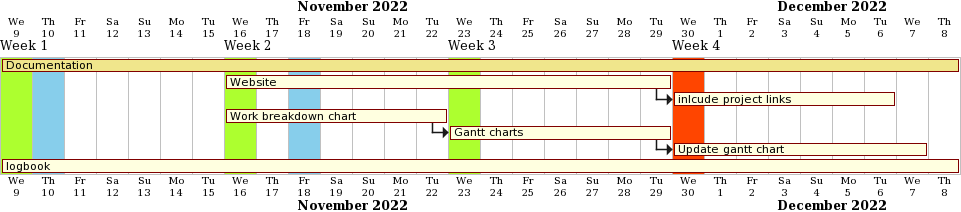

---

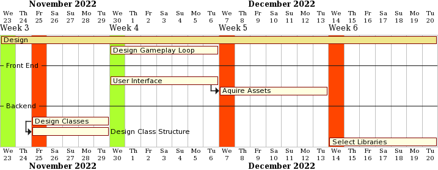

---

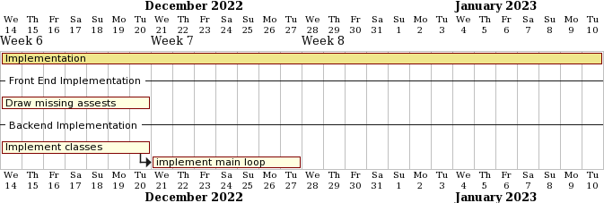

---

---

### **Version 2**

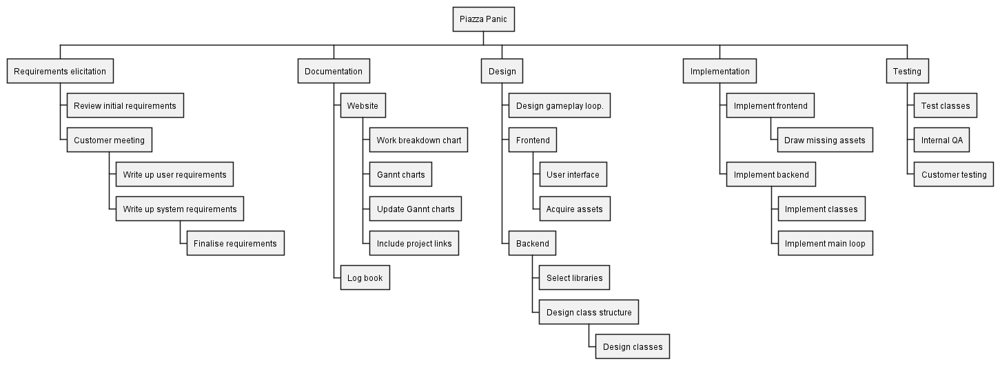

---

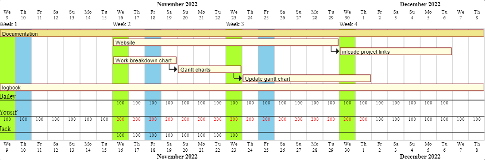

---

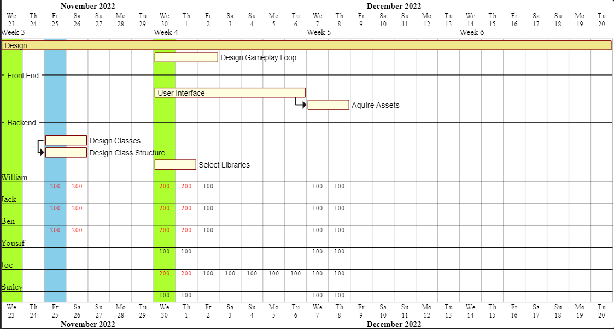

---

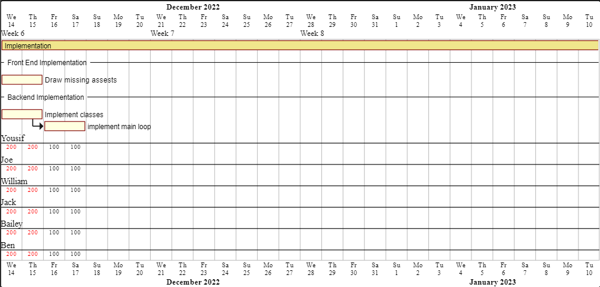

---

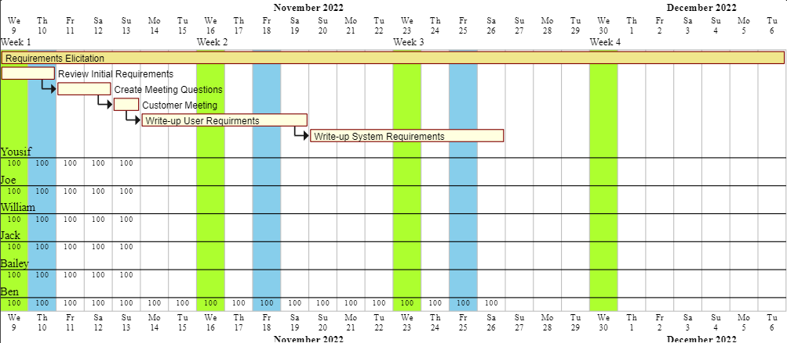

---

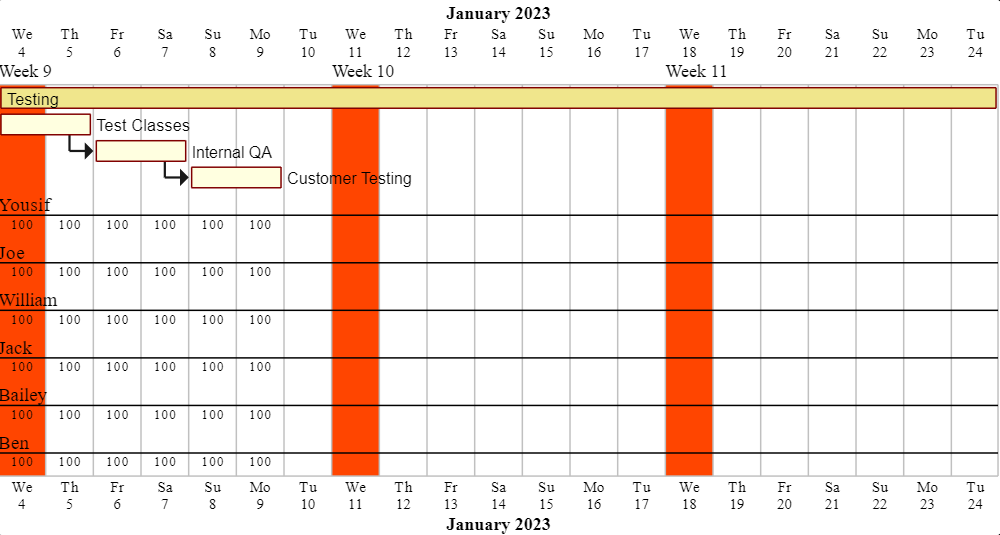

### **Version 3**

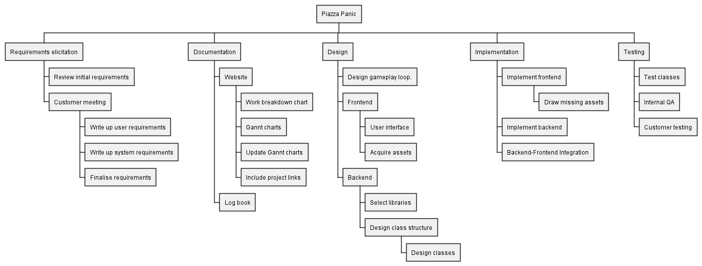

---

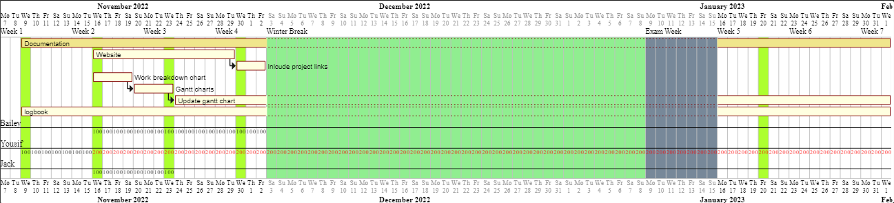

---

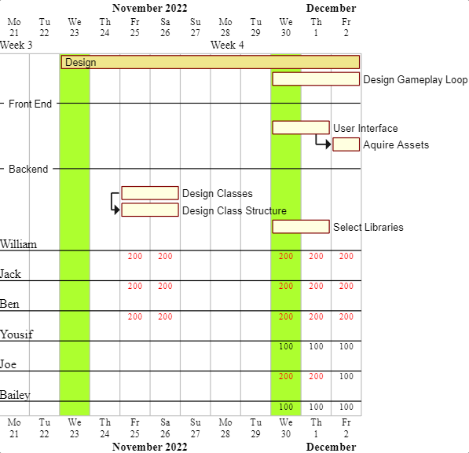

---

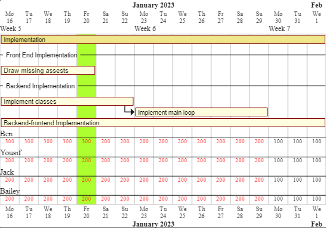

---

---

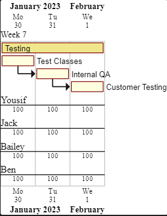

### **Version 4**

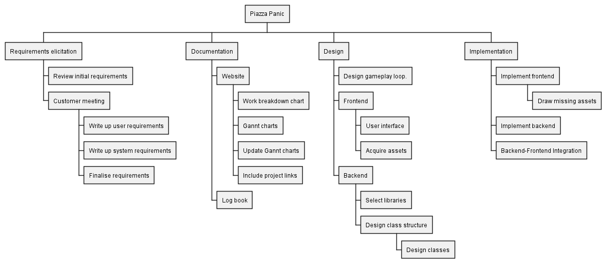

---

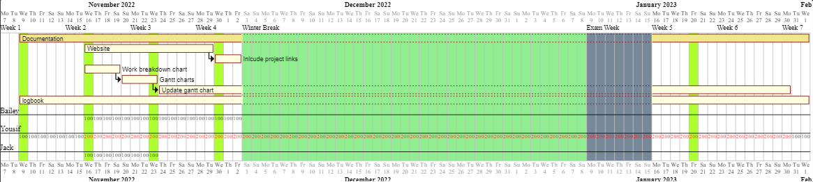

---

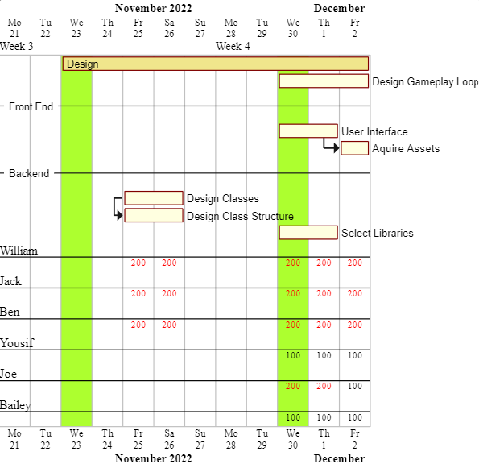

---

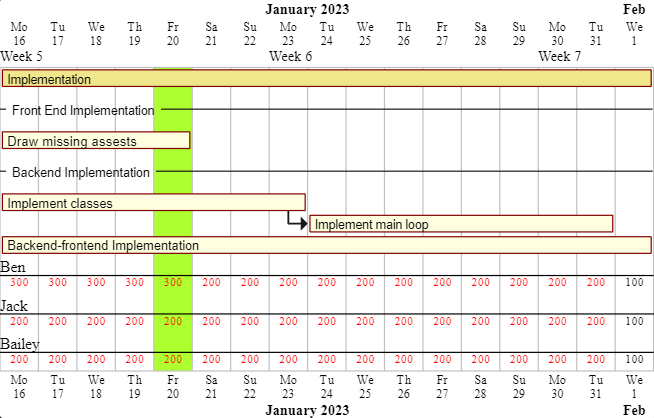

---

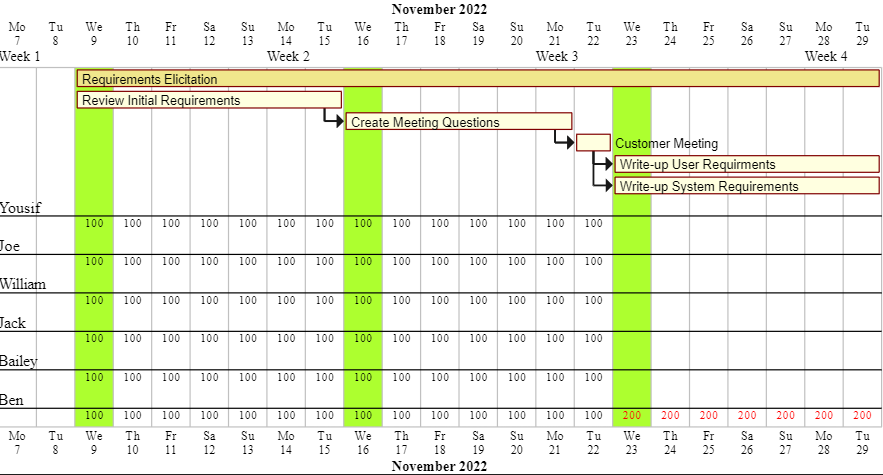

---

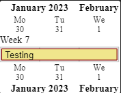

## Plan1.pdf

<object data="../pdf/Plan1.pdf" type="application/pdf" width="100%" height="500">
</object>